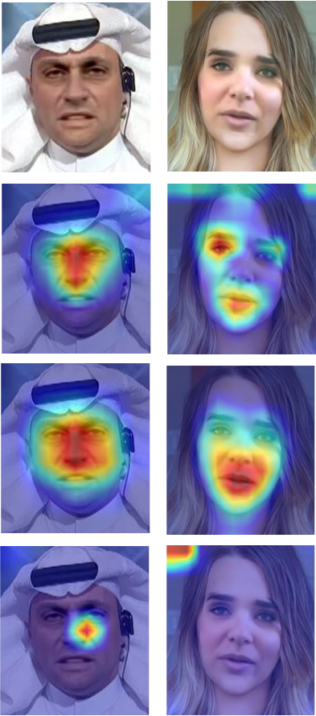

# Deepfake Image Detection by Combining XXX Attention Block

In this project, we use a convolutional neural network (CNN) to extract traces of face tampering. Furthermore, we propose an attention method applied between the blocks in the backbone network, which enhance the network to extract the parts of the image that are forged. Experiments show that our methods achieve well performance across various datasets: Using our method achieves 0.908 AUC values from DFDC and 0.941 AUC values from FaceForensics++.

## Heatmaps

From top to bottom are extracted head image, own method, efficientNet without attention, xceptionnet.

</img>